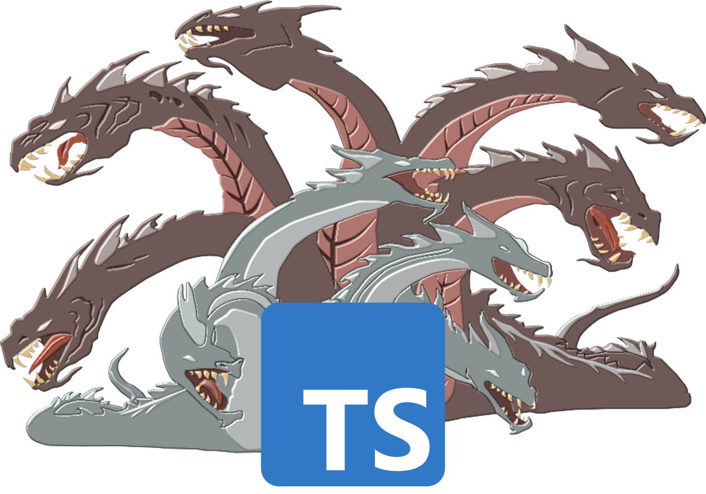

# HydraTS
HydraTS is a TypeScript library for building Hydra-powered Microservices and other distributed computing software.

Status: **Alpha** - highly experimental, not ready for production use.

---

